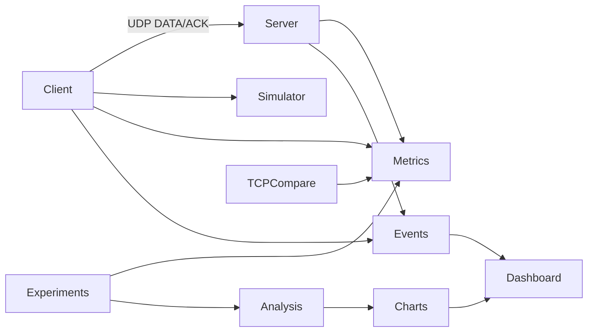

<div align="center">

# NetProbe

**UDP üzerinde güvenilir dosya aktarımı, trafik izleme ve ağ performans analizi platformu**

<br/>

[](https://github.com/enesbabekoglu/netprobe)

<br/>

[](https://www.python.org/)
[](https://flask.palletsprojects.com/)
[](https://tailwindcss.com/)
[](https://developer.mozilla.org/en-US/docs/Web/JavaScript)
[](https://pytest.org/)

<br/>

[](#protokol-özeti)
[](#web-paneli)
[](#özellikler)

</div>

## Ekip

| Ad Soyad | Öğrenci No |
| --- | --- |
| Enes Babekoğlu | 20360859113 |
| Hasan Gürfidan | 21360859074 |
| Tolgahan Demiralp | 20360859016 |

## Özellikler

- Özel **NTPB** protokolü: `START`, `DATA`, `ACK`, `END`, `RESULT`, `ERROR` paket tipleri
- **Selective Repeat** kayan pencere; `window-size=1` ile stop-and-wait modu
- Paket başına **CRC32** checksum ve dosya düzeyinde **SHA-256** bütünlük doğrulaması
- Timeout tabanlı **selective retransmission** ve yapılandırılabilir yeniden deneme limiti
- İstemci tarafı ağ simülatörü: olasılıksal **kayıp**, **gecikme** ve **jitter**
- **Throughput**, **goodput**, RTT, retransmission ve kayıp oranı metrikleri
- Otomatik deney matrisi, **TCP baseline** karşılaştırması ve SVG grafik üretimi
- JSONL olay günlüğü ve WebSocket destekli canlı izleme paneli

## Kurulum

```bash
git clone https://github.com/enesbabekoglu/netprobe.git
cd netprobe

python3 -m pip install -r requirements.txt

npm install
npm run build:assets
```

`build:assets` komutu Tailwind CSS ve arayüz ikonlarını `web/static/` altına üretir. Harici CDN kullanılmaz.

## Kullanım

### Örnek veri

```bash
python3 -m netprobe.sample_data
```

16 KB, 128 KB ve 512 KB örnek dosyaları `data/sample_files/` altında oluşturulur veya doğrulanır.

### CLI

Sunucu:

```bash
python3 -m netprobe.server --host 127.0.0.1 --port 9999
```

İstemci:

```bash
python3 -m netprobe.client send data/sample_files/small_16kb.bin \
  --host 127.0.0.1 --port 9999 \
  --payload-size 1024 --timeout 0.5 --window-size 8 --loss-rate 0.05
```

Stop-and-wait:

```bash
python3 -m netprobe.client send data/sample_files/small_16kb.bin \
  --host 127.0.0.1 --port 9999 --window-size 1
```

İstemci seçenekleri: `--max-retries`, `--delay-ms`, `--log-dir`  
Sunucu seçenekleri: `--output-dir`, `--log-dir`, `--once`, `--idle-timeout`

### Web paneli

```bash
python3 -m netprobe.web --port 5000
```

Tarayıcıda `http://127.0.0.1:5000` adresini açın. Panel gömülü bir UDP sunucusu başlatır; dosya aktarımı, canlı log izleme, deney çalıştırma ve grafik görüntüleme yapılabilir.

| Endpoint | Açıklama |
| --- | --- |
| `GET /api/status` | Sunucu durumu, örnek dosyalar, son olaylar, grafik listesi |
| `WS /ws/events` | Canlı durum akışı |
| `POST /api/transfer` | Parametreli dosya aktarımı |
| `POST /api/upload` | Kullanıcı dosyası yükleme |
| `POST /api/experiments` | Deney matrisi çalıştırma |
| `POST /api/analysis` | Grafik ve özet üretimi |

## Deneyler ve analiz

```bash
python3 -m netprobe.experiments run --profile quick   # hızlı profil
python3 -m netprobe.experiments run --profile full    # tam profil (+ pencere karşılaştırması)
python3 -m netprobe.analysis build                    # yalnızca grafik üretimi
```

`experiments run` varsayılan olarak analizi de çalıştırır; yalnızca CSV/JSON istiyorsanız `--skip-analysis` kullanın.

Deney senaryoları: `packet_size`, `timeout`, `loss_rate`, `file_size`, `stop_and_wait` / `sliding_window` (full profil), `tcp_compare`.

Çıktılar:

| Konum | İçerik |
| --- | --- |
| `outputs/experiments/` | `results.csv`, `results.json` |
| `outputs/analysis/` | `analysis-summary.md`, `charts/*.svg` |
| `outputs/logs/` | Deney ve web paneli JSONL logları |
| `outputs/received/` | Deney sırasında alınan dosyalar |
| `outputs/web_received/` | Web paneli aktarımları |
| `logs/` | CLI varsayılan istemci/sunucu logları |
| `received/` | CLI varsayılan alınan dosyalar |
| `data/uploaded_files/` | Web paneline yüklenen dosyalar |

Üretilen grafikler: paket boyutu etkisi, timeout–retransmission, kayıp–tamamlanma süresi, dosya boyutu–goodput, Reliable UDP vs TCP.

## Testler

```bash
PYTEST_DISABLE_PLUGIN_AUTOLOAD=1 python3 -m pytest
```

Kapsam: protokol encode/decode ve checksum, güvenilir aktarım, kayıp sonrası kurtarma, max retry hatası, duplicate paket yönetimi, JSONL log okuma.

## Proje yapısı

```
netprobe/
├── protocol.py      # NTPB paket formatı, CRC32, SHA-256, dosya parçalama
├── client.py        # Selective Repeat istemci, retransmission
├── server.py        # UDP sunucu, ACK, duplicate ve oturum yönetimi
├── simulator.py     # Yapay kayıp, gecikme, jitter
├── metrics.py       # TransferResult, throughput/goodput hesapları
├── events.py        # JSONL olay günlüğü
├── config.py        # Yollar, varsayılanlar, TransferConfig
├── sample_data.py   # Örnek dosya üretimi
├── experiments.py   # Deney matrisi ve TCP karşılaştırması
├── analysis.py      # SVG grafik ve Markdown özet
├── tcp_compare.py   # TCP baseline ölçümü
└── web.py           # Flask paneli, REST ve WebSocket API

web/
├── templates/       # HTML arayüz
└── static/          # CSS, JS, fontlar (build:assets ile üretilir)

data/sample_files/   # small_16kb, medium_128kb, large_512kb
scripts/             # İkon derleme (build-icons.mjs)
tests/               # Birim ve entegrasyon testleri
```

## Mimari



## Protokol özeti

| Alan | Değer |
| --- | --- |
| Magic | `NTPB` |
| Paket tipleri | START, DATA, ACK, END, RESULT, ERROR |
| Oturum | UUID tabanlı `session_id` |
| Paket bütünlüğü | CRC32 (payload) |
| Dosya bütünlüğü | SHA-256 (aktarım sonu doğrulama) |
| Maks. payload | 60 000 byte |
