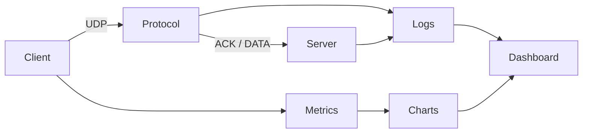

# NetProbe

[](https://www.python.org/)
[](https://flask.palletsprojects.com/)
[](https://en.wikipedia.org/wiki/User_Datagram_Protocol)
[](https://tailwindcss.com/)
[](https://developer.mozilla.org/en-US/docs/Web/JavaScript)
[](https://pytest.org/)
[](https://github.com/enesbabekoglu/netprobe)

UDP üzerinde güvenilir dosya aktarımı, trafik izleme ve ağ performans analizi platformu.

**Bursa Teknik Üniversitesi** · Bilgisayar Mühendisliği · Bilgisayar Ağları Dönem Projesi

## Ekip

| Ad Soyad | Öğrenci No |
| --- | --- |
| Enes Babekoğlu | 20360859113 |
| Hasan Gürfidan | 21360859074 |
| Tolgahan Demiralp | 20360859016 |

## Özellikler

- Sequence number, ACK, timeout ve retransmission ile güvenilir UDP aktarımı
- Sliding window ve stop-and-wait modları
- SHA-256 bütünlük doğrulaması
- Yapay paket kaybı ve gecikme simülasyonu
- Throughput, goodput ve retransmission metrikleri
- Karşılaştırmalı deney otomasyonu ve SVG grafik üretimi
- WebSocket destekli canlı izleme paneli

## Kurulum

```bash
git clone https://github.com/enesbabekoglu/netprobe.git
cd netprobe

python3 -m pip install -r requirements.txt

npm install
npm run build:assets
```

`build:assets` komutu Tailwind CSS ve arayüz ikonlarını `web/static/` altına üretir. Harici CDN kullanılmaz.

## Kullanım

### Örnek veri

```bash
python3 -m netprobe.sample_data
```

### CLI

Sunucu:

```bash
python3 -m netprobe.server --host 127.0.0.1 --port 9999
```

İstemci:

```bash
python3 -m netprobe.client send data/sample_files/small_16kb.bin \
  --host 127.0.0.1 --port 9999 \
  --payload-size 1024 --timeout 0.5 --window-size 8 --loss-rate 0.05
```

Stop-and-wait:

```bash
python3 -m netprobe.client send data/sample_files/small_16kb.bin --window-size 1
```

### Web paneli

```bash
python3 -m netprobe.web --port 5000
```

Tarayıcıda `http://127.0.0.1:5000` adresini açın. Panel üzerinden dosya aktarımı, canlı log izleme, deney çalıştırma ve grafik görüntüleme yapılabilir.

## Deneyler ve analiz

```bash
python3 -m netprobe.experiments run --profile quick   # hızlı profil
python3 -m netprobe.experiments run --profile full    # tam profil
python3 -m netprobe.analysis build
```

Çıktılar:

| Konum | İçerik |
| --- | --- |
| `outputs/experiments/` | `results.csv`, `results.json` |
| `outputs/analysis/` | `analysis-summary.md`, `charts/*.svg` |
| `outputs/logs/` | JSONL trafik logları |

## Testler

```bash
PYTEST_DISABLE_PLUGIN_AUTOLOAD=1 python3 -m pytest
```

## Teslim paketi

```bash
python3 -m netprobe.experiments run --profile quick
python3 -m netprobe.deliver
```

Çıktı: `dist/netprobe-deliverable.zip`

## Proje yapısı

```
netprobe/
├── protocol.py      # Paket formatı, checksum, SHA-256
├── client.py        # Reliable UDP istemci, sliding window
├── server.py        # UDP sunucu, ACK, duplicate yönetimi
├── simulator.py     # Yapay loss/delay
├── metrics.py       # Performans metrikleri
├── experiments.py   # Deney matrisi
├── analysis.py      # Grafik ve özet üretimi
├── tcp_compare.py   # TCP baseline karşılaştırması
└── web.py           # Flask web paneli

web/
├── templates/       # HTML arayüz
└── static/          # CSS, JS, fontlar

docs/                # Rapor taslağı ve teknik dokümantasyon
tests/               # Birim ve entegrasyon testleri
```

## Mimari


