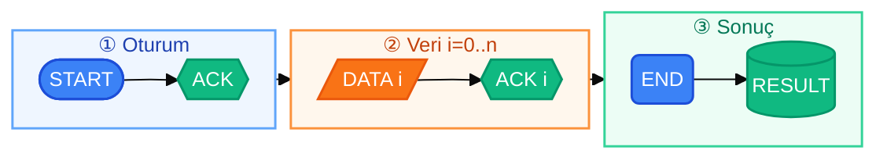

# Şekil 3. NetProbe Paket ve ACK Akışı

Bu diyagram, raporun **5. Protokol Tasarımı** bölümü için hazırlanmıştır. Paket formatı tablosunun hemen altına yerleştirilebilir. Word'e aktarırken [mermaid.live](https://mermaid.live) üzerinden PNG/SVG üretebilirsiniz.

Word'e aktarırken [mermaid.live](https://mermaid.live) üzerinde genişliği **720–780 px** olacak şekilde PNG/SVG dışa aktarın; metin ile sayfa numarası arasındaki alana sığar.

## Diyagram Açıklaması

**Şekiller:** stadium başlangıç, altıgen onay, paralelkenar veri, yuvarlak bitiş, silindir sonuç. Ok etiketleri: metadata+SHA-256 → her parça onaylanır → hash doğrulama.

| Adım | Paket | Gönderen | Açıklama |
| --- | --- | --- | --- |
| 1 | START | Client | Dosya metadata bilgisi gönderilir |
| 2 | ACK | Server | Oturum onaylanır |
| 3–4 | DATA[i] / ACK[i] | Client / Server | Parçalar sırayla aktarılır ve onaylanır |
| 5 | END | Client | Aktarım sonlandırılır |
| 6 | RESULT | Server | Dosya birleştirilir, SHA-256 doğrulanır |
