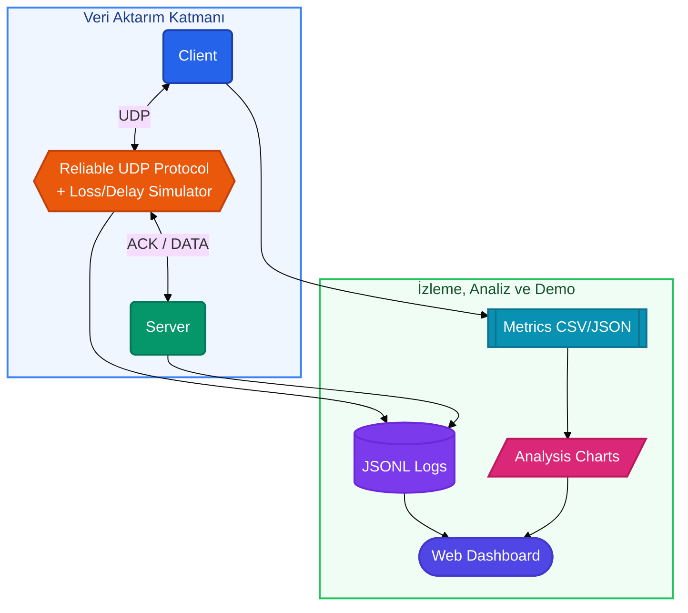

# Şekil 2. NetProbe Sistem Mimarisi

Bu diyagram, raporun **4. Sistem Mimarisi** bölümü için hazırlanmıştır. Word'e aktarırken Mermaid çıktısını görsel olarak dışa aktarabilir veya [mermaid.live](https://mermaid.live) üzerinden PNG/SVG üretebilirsiniz.

## Diyagram Açıklaması

- **Üst bant:** Client, Reliable UDP Protocol + Loss/Delay Simulator ve Server yatay aktarım hattını oluşturur.
- **Alt bant:** JSONL Logs, Metrics CSV/JSON, Analysis Charts ve Web Dashboard çıktıları yatay sıralanır.
- **Şekiller:** yuvarlak `( )` istemci/sunucu, altıgen `{ }` protokol katmanı, silindir `[( )]` log, dikdörtgen `[[ ]]` metrik, paralelkenar `/ /` grafik, stadium `([ ])` web paneli.
- **Renkler:** Mavi (client), turuncu (protokol), yeşil (server); alt katmanda mor, camgöbeği, pembe ve indigo tonları kullanılır.
